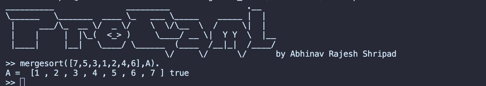

# ProCaml: Prolog Interpreter in OCaml

ProCaml is a Prolog interpreter implemented in OCaml. It allows you to define Prolog-like programs and query them to find solutions.

## Features

- Supports defining clauses, heads, bodies, atoms, symbols, terms, variables, substitutions, goals, and more.
- Implements unification, backtracking, and goal-solving algorithms.
- Handles arithmetic operations within terms.
- Provides a simple command-line interface for running queries.

## Usage

To load a prolog file by the name "file.pl" run the following command

```bash
make
./main file.pl
```

If the program is syntactically correct, it will show the following screen :-



After this you can enter your queries. To exit enter "exit" or "quit".

## Copyright
_can I copy this?_  

This is my intellectual property, original creation, and is copylefted. Use it for anything, but be warned that I am not liable, in any way, for any misuse, real or perceived, of this code.

This work is licensed under a [Creative Commons Attribution-ShareAlike 3.0 Unported License](http://creativecommons.org/licenses/by-sa/3.0/).